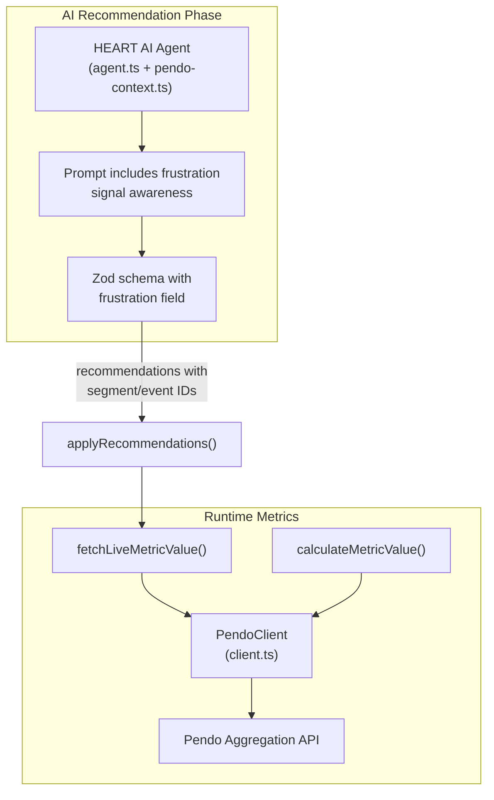

# Add Frustration Signals to HEART Metrics

## Why No MCP

MCP was considered and rejected for this feature:

- **Short-lived auth** -- OAuth tokens require a human in the loop to refresh; not viable for unattended server-side use
- **Marginal discovery value** -- the AI agent already receives the full Pendo event/feature list and does keyword matching; MCP would do roughly the same thing with more moving parts
- **No new dependency** -- keeping the stack simple; the existing Aggregation API + Claude agent handles everything needed

## Scope

Track four Pendo-native frustration indicators as new HEART measurement types:

- Dead clicks -- click with no visible DOM response
- Rage clicks -- rapid repeated clicks in a focused area
- Error clicks -- click triggering a JS error within 100ms
- U-turns -- page navigation reversed within 7 seconds

Implement as custom metrics (not a sixth HEART category). Lower is better (inverse targeting).

## Phase 0: Aggregation API Validation (Required)

Before writing feature code, confirm the runtime data path:

1. **Test direct frustration type filtering** -- Try `type == "rage_click"` (and similar) in the Aggregation API pipeline filter. If Pendo supports this alongside `type == "feature"` and `type == "track"`, we get direct frustration counts per feature/page.
2. **Test segment-based fallback** -- Create Pendo segments filtered by frustration indicator type (Pendo UI supports this per the docs). Query those segments via the existing `PendoClient.getEventPercentage()` / `getUniqueVisitors()` with `segmentId`. This is the proven fallback path.
3. **Test Track Event proxy** -- Check if your app already sends any Track Events matching frustration patterns (event names containing "error", "fail", "retry", etc.). These can be counted directly.

**Outcome**: Establish which query pattern works and document it. All three paths use existing `PendoClient` methods -- no new API client code needed, just new query configurations.

---

## Architecture




---

## Files to Change

### 1) Types -- `src/lib/heart/types.ts`

Add to `HeartMeasurementType`:

```typescript
| 'frustration_dead_clicks'
| 'frustration_rage_clicks'
| 'frustration_error_clicks'
| 'frustration_u_turns'
| 'frustration_composite_score'
```

Add to `EpicHeartMetric`:

```typescript
target_direction: 'increase' | 'decrease';
```

Add to `HeartAgentRecommendation`:

```typescript
frustration?: {
  signals: ('dead_clicks' | 'rage_clicks' | 'error_clicks' | 'u_turns')[];
  eventIds: string[];
  segmentId?: string | null;
  measurementType: HeartMeasurementType;
  targetValue?: number | null;
  targetTimeframeDays?: number | null;
  rationale: string;
};
```

### 2) AI Agent -- `src/lib/heart/agent.ts`

No new dependencies. Changes:

**Zod schema**: Add optional `frustration` field matching the type above.

**Prompt** (`buildHeartAgentPrompt()`): Add a new section after the existing HEART categories:

```
## Frustration Signals (Reduction Tracking)
Pendo tracks four frustration indicators automatically:
- Rage clicks: repetitive clicks in a focused area
- Error clicks: clicks generating JS errors within 100ms
- Dead clicks: clicks with no visible response
- U-turns: page visit reversed within 7 seconds

If you see events suggesting user frustration (error events, failed submissions,
retry patterns, or events on features known for usability issues), recommend a
frustration reduction metric. Use the segment ID if available, or reference
the relevant feature/event IDs.

Frustration targets are INVERSE -- lower is better. Suggest a target representing
the acceptable frustration rate, with the goal of reducing below it.
```

**Validation**: Add frustration to `validateRecommendations()` (same pattern as existing categories -- filter invalid event/feature IDs).

### 3) Service -- `src/lib/heart/service.ts`

`**applyRecommendations()**` (~line 645): Add frustration block:

- `is_custom: true`
- `custom_category_label: 'Frustration'`
- `target_direction: 'decrease'`
- Links segment ID and/or event IDs from recommendation
- Creates milestones with decreasing targets

`**fetchLiveMetricValue()**` (~line 86): Add frustration cases:

- Query PendoClient using the segment/event IDs stored on the metric
- Same methods already used (getEventCount, getUniqueVisitors, getEventPercentage)
- Inverse status logic: value below target = ON_TRACK, above = AT_RISK/MISSED
**Status calculation** (~line 260): Add `target_direction` check:

```typescript
if (metric.target_direction === 'decrease') {
  // Invert: lower is better
  if (value <= targetValue * 1.1) status = 'ON_TRACK';
  else if (value <= targetValue * 1.3) status = 'AT_RISK';
  else status = 'MISSED';
}
```

### 4) Snapshot Calculator -- `src/lib/heart/snapshot-calculator.ts`

Add frustration cases in `calculateMetricValue()`:

- Same PendoClient queries as live path
- Same inverse status via `target_direction`
- `determineStatus()` updated to handle decrease direction

### 5) Database Migration

New migration file in `supabase/migrations/`:

- `ALTER TABLE epic_heart_metrics ADD COLUMN target_direction TEXT NOT NULL DEFAULT 'increase'`
- Seed frustration template in `heart_custom_metric_templates`:
  - name: 'Frustration Signals'
  - category_label: 'Frustration'
  - measurement_type: 'frustration_composite_score'
  - default_target_value: 50 (per 1,000 sessions)
  - default_target_timeframe_days: 30

### 6) PRD Update -- `docs/PRD-Retroactive.md`

Document frustration signal tracking, inverse targeting, and composite score formula.

---

## Composite Score Formula

```
score = (1*dead + 2*rage + 2*error + 1*u_turn) / total_sessions * 1000
```

Unit: weighted frustration events per 1,000 sessions. Rage and error clicks weighted 2x (stronger frustration signals). Weights stored in metric config, tunable per-epic.

## Test Plan

- Inverse target status: `target_direction='decrease'` produces correct ON_TRACK/AT_RISK/MISSED
- Frustration metric calculation via PendoClient segment queries
- Agent Zod validation: frustration recommendation validated and filtered correctly
- Migration: existing rows get `target_direction='increase'` default, no data loss
- Agent without frustration data: gracefully skips frustration recommendation

## Acceptance Criteria

- Phase 0 validation report: which API query pattern works for frustration data
- Frustration metrics configurable and displayed end-to-end in HEART dashboard
- AI agent recommends frustration tracking when relevant events/segments exist
- No regressions to existing HEART metrics
- PRD updated

