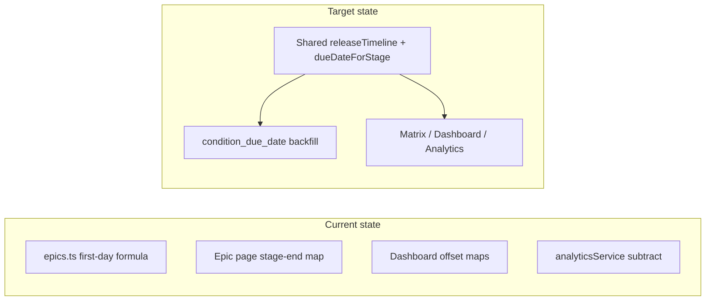

# Unify criterion due dates and labels

## Scope split

1. **Operational bug — dates not refreshed when the schedule moves**
  **Addressed in [PR #15](https://github.com/arnaudgrunwald0404/cleargo/pull/15)** (`cascadeReleaseDateToEpics`, PATCH `/api/releases/[id]`, Aha `sync-releases` / `sync-releases-epics` recalc). Merge that (or cherry-pick) into this repo; no need to re-implement from scratch. Still **orthogonal** to the formula: it only ensures recalculation **runs** after schedule changes.
2. **Architectural issue — “Due On” computed differently in different places**
  **This plan’s remaining work.** After PR #15 lands, `recalculateDueDatesForEpic` will keep calling today’s `calculateDueDateForCriterion` until you **replace** that with the shared module—then cascade paths automatically persist **canonical** dates.

## Problem summary

Today, “Due On” is computed in **four incompatible ways**:

| Location                                                                                                  | Behavior                                                                                                             |
| --------------------------------------------------------------------------------------------------------- | -------------------------------------------------------------------------------------------------------------------- |
| `[src/lib/db/epics.ts](src/lib/db/epics.ts)` `calculateDueDateForCriterion`                               | “First day of stage” style offset from `target_launch_date` (scope + Cohort 1 boundary + optional `level_durations`) |
| `[src/app/epics/[id]/page.tsx](src/app/epics/[id]/page.tsx)`                                              | **Stage end** = next stage start (timeline walk), **overrides** `condition_due_date` when `rating_timing` resolves   |
| `[src/components/HomeDashboard.tsx](src/components/HomeDashboard.tsx)`                                    | Prefer `condition_due_date`; else hardcoded `sort_order === 3` pre-launch split, no scope/UI level                   |
| `[src/lib/services/analyticsService.ts](src/lib/services/analyticsService.ts)` `computeDueDateFromStages` | Different subtract-only formula; fragile edge cases                                                                  |

Timeline math is also **duplicated** between `[src/app/epics/[id]/page.tsx](src/app/epics/[id]/page.tsx)` (inline `computedStageEndDates`) and `[src/components/admin/ReleaseStagesChart.tsx](src/components/admin/ReleaseStagesChart.tsx)` `useTimelineData` (similar but not identical rules, e.g. Cohort 1 / anchor pinning).

Tooltips use `[Matrix.tsx](src/components/Matrix.tsx)` `Due by end of ${due_by_stage_name}` where `due_by_stage_name` is raw `[release_stages.name](src/app/epics/[id]/page.tsx)` — ambiguous names (e.g. “Cohort 1”) read like customer rollout even when the date is the **boundary** before that phase.

## Product decision (locked for implementation)

- **Canonical meaning**: “Due On” = **calendar date of the end of the rated release stage** — i.e. the same **boundary** the epic matrix already uses when it builds `computedStageEndDates` (end of segment = start of next stage / milestone).
- **Stored field**: `epic_criterion_status.condition_due_date` should match that definition so jobs (`[criteria-nudges](src/app/api/jobs/criteria-nudges/route.ts)`), Slack, and My Tasks agree with the matrix without special cases.

## Implementation plan

### 0. Cascade bug fix (PR #15 — do not duplicate)

- **Merge** [PR #15](https://github.com/arnaudgrunwald0404/cleargo/pull/15) (or equivalent) rather than re-implementing here.
- **Optional review** after merge: PostgREST `.or()` with interpolated `releaseName` — consider escaping or an alternate query if release names can contain filter-special characters.

### 1. Extract shared timeline + stage-end computation

Add a focused library module, e.g. `[src/lib/releaseTimeline/computeStageEndDates.ts](src/lib/releaseTimeline/computeStageEndDates.ts)` (name can vary), that:

- **Inputs**: `release_stages` rows (same shape as today: `id`, `name`, `sort_order`, `duration_days`, `level_durations`, `scope` if needed), `target_launch_date`, optional **UI Rollout** `uiLevel`, optional `cohort2Date`, and the same **traditional** overrides the matrix applies today (penultimate stage pinned to anchor, last stage optional cohort2 override — see `[page.tsx](src/app/epics/[id]/page.tsx)` ~776–803).
- **Outputs**: `Map<number, string>` (stage id → ISO date **string** local/UTC consistent with existing `dateToLocalDateString` usage), and optionally stage starts for reuse by the chart.
- **Implementation strategy**: Lift the **epic detail page** timeline logic into this module first (it drives the matrix), then refactor `[ReleaseStagesChart.tsx](src/components/admin/ReleaseStagesChart.tsx)` `useTimelineData` to consume the same primitive(s) so the **admin chart** and **epic matrix** cannot drift.

Reuse existing primitives from `[src/lib/date-utils.ts](src/lib/date-utils.ts)` where possible; move business-day helpers out of the epic page into `date-utils` or the new module if they are not already shared.

### 2. Single function: due date for a criterion row

Add something like `getCriterionDueDate({ stages, targetLaunchDate, ratingTimingId, uiLevel, cohort2Date, ... })` that:

1. Builds the stage-end map via step 1.
2. Resolves `rating_timing` the same way as today (optional bridge map + category fallback can remain in the caller or be a small `resolveRatingStageId` helper used by epic page only).
3. Returns the **end date** for that stage id (and the resolved stage id for labeling).

### 3. Replace server persistence

- Replace the body of `[calculateDueDateForCriterion](src/lib/db/epics.ts)` to call the shared function after fetching stages (same query fields as today). **Remove** the separate “first day of stage” math so new instantiations and `[recalculateDueDatesForEpic](src/lib/db/epics.ts)` write the **same** dates the UI shows.
- Ensure **scope** handling matches the matrix: today `calculateDueDateForCriterion` filters by `scope`; the extracted timeline must use the **same** stage list as the epic page for each epic type (Release Schedule vs UI Rollout). If the epic page filters stages by scope before computing, the shared API must take **pre-filtered** stages or accept `scope` explicitly.

### 4. Refactor clients to call the shared module

- **Epic detail page**: Delete duplicated `computedStageEndDates` construction; call shared `computeStageEndDates` + `getCriterionDueDate`. Keep `due_by_stage_name` as `release_stages.name` for the resolved id (or see step 6).
- **HomeDashboard**: Remove `[stageDaysBeforeLaunch` / `stageDaysAfterLaunch](src/components/HomeDashboard.tsx)` maps built from `sort_order === 3`. For each item, compute due date via shared logic using `item.launch.target_launch_date`, `item.criterion.rating_timing`, and **UI level** if the epic is UI Framework (may require the API to include the same Aha-derived level fields the epic page uses — verify `[/api/my-items](src/app/api/my-items)` payload and extend if needed).
- **analyticsService**: Remove `[computeDueDateFromStages](src/lib/services/analyticsService.ts)`; use shared `getCriterionDueDate` with fetched stages + epic `target_launch_date`.

### 5. Backfill and jobs

- After deployment, run `**recalculateDueDatesForEpic`** for all non-archived epics (one-off script or admin action, or extend existing epic sync) so `condition_due_date` aligns with the new definition.
- Verify `[criteria-nudges](src/app/api/jobs/criteria-nudges/route.ts)` and Slack copy still make sense with shifted dates (communicate to ops).

### 6. Tooltip and naming copy (reduce “Cohort 1” confusion)

- **Minimal code fix**: Change tooltip from `Due by end of ${name}` to something fact-based, e.g. **“Due on [date] — end of stage: [name]”** so the **date** is primary and the stage name is secondary (`[Matrix.tsx](src/components/Matrix.tsx)`).
- **Optional data fix** (if names stay ambiguous): add optional `short_label` or `due_tooltip_label` on `release_stages` (admin-editable) and prefer it in Matrix when set; otherwise fall back to `name`. This avoids another round of migrations for every environment if you only rename stages in **Settings → Release stages**.

### 7. Tests and docs

- Add unit tests for `computeStageEndDates` / `getCriterionDueDate` with **fixture** stage arrays covering: traditional release with Cohort 1 stage, UI Rollout with `level_durations`, cohort2 override.
- Update `[docs/PRD-Retroactive.md](docs/PRD-Retroactive.md)` with a short “Criterion due dates” subsection: single definition, where it is implemented, backfill behavior.

## Risks / scope notes

- **Date shifts**: Moving stored dates from “first day” to “end of stage” will change overdue/nudge behavior; treat as an intentional product correction and coordinate comms.
- **Performance**: Shared pure functions are cheap; avoid N+1 fetches on Home Dashboard — batch epic metadata if you add UI level per item.

